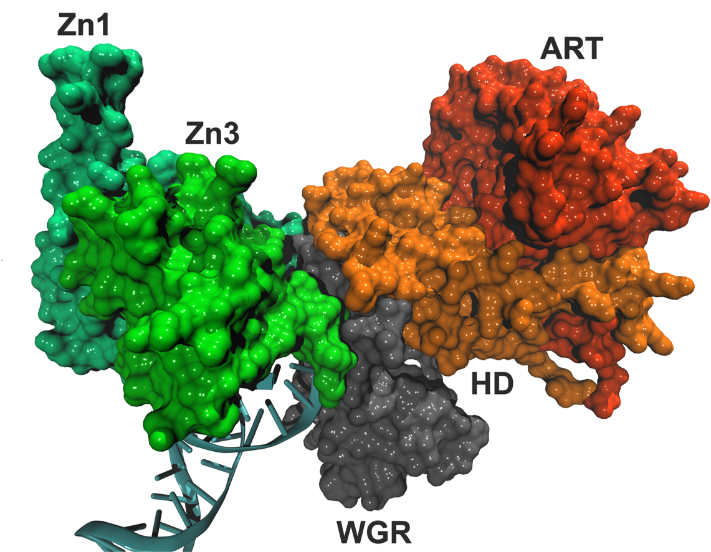

Welcome and thank you for viewing my personal Git page! This site will provide links to programs and projects I have worked on.

## About Me

I am seeking to transition from academia to industry. I am self-motivated and a fast learner, and I love working on team-based collaborations.

With a Ph.D. in molecular biophysics, a Ph.D. minor in education, and a Bachelor of Engineering, I have a multi-disciplinary background. I have three years of computational biology, Python programming, and open-source tool-development experience, as well as ten years of wet lab experience. I hope to bring my diverse background in science, engineering, and communications to tackle interdisciplinary challenges. 
